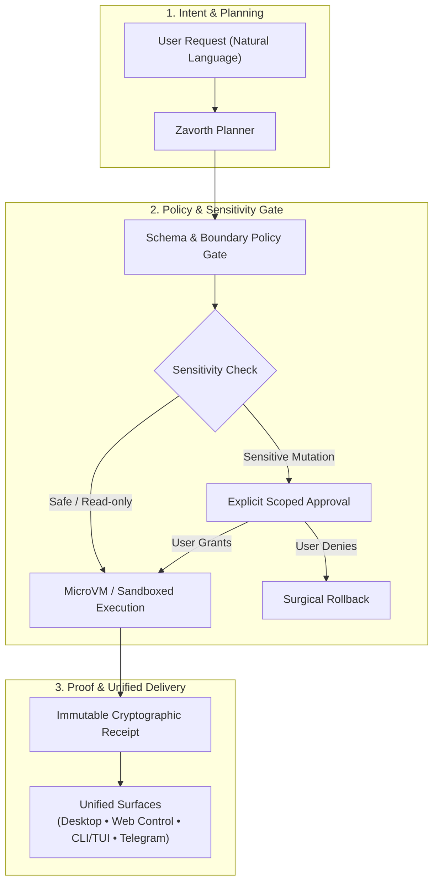

<p align="center">
  
</p>

<p align="center">
  
</p>

<h1 align="center">Zavorth</h1>

<p align="center">
  <strong>Your AI that does things — and proves it.</strong><br>
  Ask naturally. Approve only real risk. Keep cryptographic receipts for every completed run.
</p>

<p align="center">
  <a href="https://github.com/zavorth/zavorth/actions"></a>
  
  
  <a href="docs/security.md"></a>
  
  <a href="LICENSE"></a>
</p>

---

Zavorth is a local-first agent runtime designed for high-stakes, dependable work with visible plans, scoped approvals, controlled memory, and verifiable execution. It connects the same governed agent across Desktop, Zavorth Control, CLI/TUI, and remote channels without turning natural language into hidden shell shortcuts or unmonitored scripts.

---

## Quick Start

Requires Node.js 18 or newer (Node.js 20+ LTS recommended).

```bash
# Global installation
npm install -g zavorth@latest

# Bootstrap and launch
zavorth setup
zavorth start
zavorth open
```

`zavorth open` launches the official Control dashboard in your default browser. The runtime also exposes it at `/control` (`/zavorthControl` remains supported as a legacy route).

Start an interactive terminal conversation at any time:

```bash
zavorth chat
```

For setting up a brand-new workspace, follow the [BOOTSTRAP.md](BOOTSTRAP.md) guide. For every CLI command and TUI workflow, see [docs/zavorth-cli.md](docs/zavorth-cli.md).

---

## Governed Execution Lifecycle



---

## Why Zavorth? (Governed Runtime vs Generic Agents)

| Capability | Generic AI Agents (Raw Shell / Wrappers) | Zavorth Governed Runtime |
| :--- | :--- | :--- |
| **Command Execution** | Unrestricted shell access with blind execution | **Strict MicroVM isolation & Schema policy gates** |
| **Sensitive Actions** | Executes mutations without human oversight | **Explicit, scoped, expiring human approvals** |
| **Auditability & Proof** | Ephemeral, lost terminal stdout | **Immutable cryptographic receipts (`receipts/`)** |
| **Memory Management** | Global uncurated prompt dumping | **Workspace-scoped, consent-aware, inspectable** |
| **Unified Surfaces** | Fragmented CLI scripts | **Synchronized Desktop, Web Control, CLI, & Telegram** |
| **Self-Evolution** | Uncontrolled overwrites | **Preview-first self-modification with instant rollback** |

---

## Surfaces & Interfaces

| Surface | Focus & Best For |
|---|---|
| **Desktop App** | Daily chat, file navigation, workboard, automations, live approvals, receipts, and settings. |
| **Zavorth Control** | Operations center, provider telemetry, active channels, node orchestration, and diagnostics. |
| **CLI / TUI** | High-speed setup, keyboard-first development, system repair, and background scripting. |
| **Remote Channels** | Governed interaction through Telegram and supported enterprise communication channels. |

The Desktop keeps terminal output and execution logs inside a deliberate, structured workspace rail rather than floating over unrelated windows.

---

## Trust & Security Architecture

Zavorth treats model output, tool output, retrieved web content, and channel messages as untrusted until validated through boundary schemas. High-risk execution uses the strongest available sandbox and fails closed when isolation is unavailable. Secrets remain exclusively in secure local configuration, never in prompts, receipts, or client bundles.

Essential operational commands:

```bash
zavorth status        # Inspect runtime health and provider statuses
zavorth doctor        # Run automated environment diagnostics and repairs
zavorth providers     # Manage pluggable LLM backends (OpenAI, Anthropic, Ollama, etc.)
zavorth capabilities  # List active tools, skills, and sandboxes
zavorth approvals     # Audit pending and past permission requests
zavorth receipts      # Inspect verifiable execution proofs
```

---

## Controlled Self-Modification

All runtime modifications and agent self-improvements are **preview-first**. A proposed change is never written to disk until an authorized user explicitly reviews and applies it.

```text
/selfmod <relative_file> -- <instruction>
/selfmod goal -- <goal>
/selfmod apply <preview_id>
/selfmod rollback <change_id>
```

See [docs/self-modification.md](docs/self-modification.md) for authorization, safety bounds, rollback mechanics, and audit behavior.

---

## Documentation Index

- [Quickstart Guide](docs/quickstart.md)
- [CLI & TUI Reference](docs/zavorth-cli.md)
- [Desktop Experience Guide](docs/desktop.md)
- [Zavorth Control Architecture](docs/web-zavorthControl.md)
- [Security & Governance Model](docs/security.md)
- [Core Architecture](docs/architecture.md)
- [Product Direction & Roadmap](docs/product-direction.md)
- [Operations & Maintenance](docs/operations.md)
- [Contributing Guidelines](CONTRIBUTING.md)

---

## Local Development & Testing

```bash
# Install dependencies
npm install

# Run complete test suite (typecheck, security gates, unit, integration)
npm test
```

The repository enforces dedicated type, architecture, security, visual, accessibility, and cross-surface gates before any change is merged.

---

## License

MIT — see [LICENSE](LICENSE) for full details.
