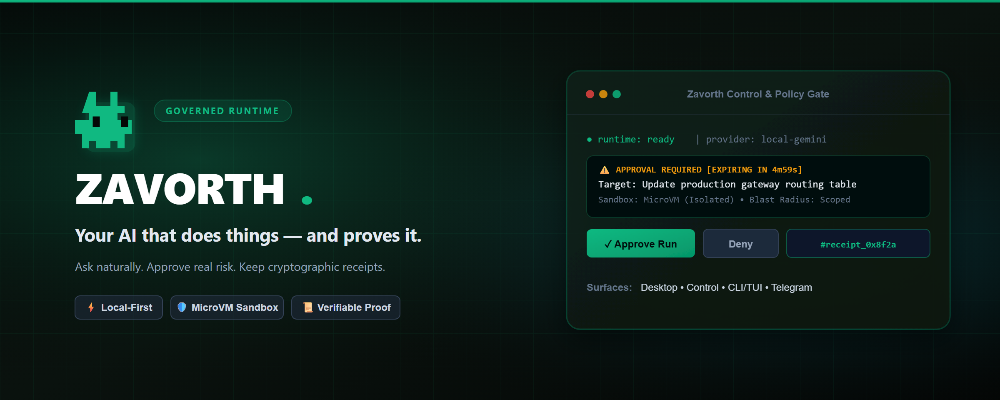

<div align="center">
  

  <h1>Zavorth</h1>

  <p>
    <strong>Ask naturally. Execute safely. Keep evidence.</strong>
  </p>

  <p>
    A local-first agent operating system for governed automation, code work,
    document understanding, remote approvals, provider routing, and auditable
    autonomous workflows.
  </p>

  <p>
    <a href="LICENSE"></a>
    <a href="docs/05-security.md"></a>
    <a href="docs/36-runtime-readiness.md"></a>
    <a href="docs/34-zavorth-cli.md"></a>
  </p>

  <p>
    <a href="#start-fast">Start Fast</a> |
    <a href="#what-zavorth-does">What It Does</a> |
    <a href="#daily-operator-flow">Daily Flow</a> |
    <a href="#command-map">Commands</a> |
    <a href="#trust-model">Trust Model</a> |
    <a href="#repo-map">Repo Map</a> |
    <a href="docs/README.md">Docs</a>
  </p>
</div>

---

## What Zavorth Is

Zavorth is not a loose chatbot wrapped around shell commands. It is a governed
runtime that receives natural language, classifies intent, routes work through
approved surfaces, and records evidence for what happened.

It is built for users who want an agent that can be useful every day without
silently taking unlimited control of their machine.

## Start Fast

Install the current CLI:

```bash
npm install -g zavorth@latest
```

For a local checkout:

```bash
npm install
npm run zavorth:operator-check
npm run zavorth:ready-to-go
npm run dashboard
```

The primary user surface is `/dashboard`: open it for readiness, providers,
approvals, receipts, skills, review, memory, and daily operator work.

For terminal-first use:

```bash
npx zavorth tui
npx zavorth status
npx zavorth ready
npx zavorth trust
```

For the safest first run, open the dashboard, connect a provider, review the
readiness report, then send one normal request:

```text
Review this repository and tell me what is risky.
```

## What Zavorth Does

| Surface | What it gives you |
| --- | --- |
| Natural First Runtime | Free text enters the agent gateway instead of dying in a shallow command path. |
| Dashboard | Operator home for readiness, approvals, providers, receipts, tasks, skills, and review. |
| CLI/TUI | A terminal surface for status, smart commands, provider state, approvals, and daily checks. |
| Telegram and channels | Remote operation with governed approvals, receipts, and channel-aware responses. |
| Provider Catalog | A large provider and model catalog with readiness, live proof, fallbacks, and safe status. |
| Mnemos | Scoped local memory and universal file understanding for documents, PDFs, images, and archives. |
| Echo | Voice and TTS control surface with clear provider readiness. |
| Nexus | Integration and connector map for the user's local environment. |
| Swarm v2 | Multi-agent work planning with budgets, isolation policies, replay, and synthesis. |
| Agent Review | Read-only code review by default, with patch application separated behind approval. |
| Skill Ecosystem | Zavorth-native skills, routing, curation, quality scoring, and approval-based evolution. |
| Transaction Plane | Transaction preview, mandate checks, approval, ledger, simulation, and live execution gates. |

## Daily Operator Flow

1. Ask naturally in the dashboard, CLI, Telegram, or API.
2. Zavorth classifies the request as chat, memory, review, skill, tool, provider, approval, or execution.
3. Low-risk work responds quickly. Sensitive work becomes a preview.
4. You approve, reject, defer, or grant a scoped permission.
5. Zavorth executes only through the governed gateway.
6. Receipts, ledger entries, and memory updates explain what happened.
7. You can review, revoke, replay, or roll back where a rollback path exists.

## Command Map

| Command | Purpose |
| --- | --- |
| `npm run zavorth:operator-check` | One command operator check for daily readiness. |
| `npm run zavorth:ready-to-go` | Launch guard for remote use and provider readiness. |
| `npm run zavorth:provider-model-catalog` | Show provider and model catalog status. |
| `npm run zavorth:provider-parity` | Validate nominal provider coverage and safe readiness. |
| `npm run zavorth:skill-ecosystem` | Inspect native skill ecosystem coverage. |
| `npm run zavorth:skill-curator-live-loop` | Preview skill quality, merge, and evolution proposals. |
| `npm run zavorth:agent-review` | Run governed agent review. |
| `npm run zavorth:trust-approval-ux-final` | Inspect approval posture, persistent permissions, and break-glass controls. |
| `npm run zavorth:supremacy-parity:check` | Full parity and hardening certification check. |
| `npm run security:ci` | Security, identity, secret, and hardening checks. |

## Trust Model

Zavorth is designed to be proactive without becoming reckless.

- Sensitive actions require policy, preview, approval, and receipt.
- Natural approval is supported, but risky grants stay scoped by time, action, channel, and limit.
- Break-glass mode exists for extreme cases, but it is still explicit, audited, revocable, and guarded.
- Secrets are handled as references and must not be serialized into prompts, logs, receipts, or screenshots.
- External agents, providers, sandboxes, and skills are configurable capabilities, not silent dependencies.
- Providers are cataloged honestly: configured and proven routes are marked ready; missing credentials stay "not configured".
- Transaction and execution flows prefer simulation, preview, and audit before any live operation.

## Repo Map

| Path | Role |
| --- | --- |
| `src/` | Core runtime, services, providers, gateways, policy, and dashboard integration. |
| `scripts/` | Operator commands, readiness checks, certification packs, and local tooling. |
| `tests/` | Unit, runtime, security, gateway, provider, dashboard, and skill checks. |
| `docs/` | Product docs, architecture notes, security posture, operations, and roadmap. |
| `skill-library/` | Native skills, governed curation inputs, and approved skill surfaces. |
| `assets/` | Brand, dashboard, social, and repository presentation assets. |
| `agent/` | Runtime-side agent support and voice/media helpers. |
| `apps/` | Application surfaces and companion app code. |
| `data/` | Local evidence, receipts, live proof, state snapshots, and runtime artifacts. |

## Status Honesty

Zavorth can know about a provider, channel, backend, or skill without pretending
it is live. A capability is only treated as ready when its configuration,
policy, and proof allow it.

That means the repo may show many cataloged routes while only a subset is
active on a specific machine. This is intentional: it keeps setup simple, avoids
false readiness, and prevents accidental execution with missing credentials.

## Documentation

- [Documentation index](docs/README.md)
- [Quickstart](docs/02-quickstart.md)
- [Architecture](docs/03-architecture.md)
- [Security](docs/05-security.md)
- [Telegram](docs/06-telegram.md)
- [Web dashboard](docs/07-web.md)
- [CLI guide](docs/34-zavorth-cli.md)
- [Runtime readiness](docs/36-runtime-readiness.md)
- [External agent onboarding](docs/37-external-agent-onboarding.md)
- [External agent gateway](docs/38-external-agent-gateway.md)
- [Capability mesh](docs/39-capability-mesh.md)
- [Roadmap](docs/11-roadmap.md)

---

<div align="center">
  <sub>Zavorth is built for autonomous work with local control, explicit trust, and visible evidence.</sub>
</div>
