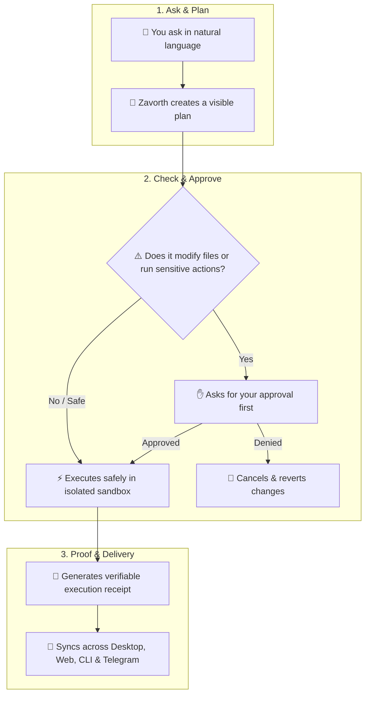

<p align="center">
  
</p>

# Zavorth 🛡️

<p align="center">
  <a href="docs/quickstart.md">Quickstart</a> •
  <a href="docs/desktop.md">Zavorth Desktop</a> •
  <a href="docs/web-zavorthControl.md">Zavorth Control</a> •
  <a href="docs/zavorth-cli.md">CLI Reference</a> •
  <a href="docs/security.md">Security Model</a>
</p>

<p align="center">
  <a href="docs/quickstart.md"></a>
  
  
  <a href="docs/security.md"></a>
  
  <a href="LICENSE"></a>
</p>

<p align="center">
  
  
</p>

**The dependable autonomous AI agent runtime built for real work.** Zavorth connects your agent across Desktop, Web Control, Terminal, and remote channels. It introduces human approvals for sensitive actions, runs tasks in protected sandboxes, and keeps verified receipts for every completed run. Ask naturally, approve real risk, and keep full control.

Use any AI model you prefer — **OpenAI**, **Anthropic**, **Google Gemini**, **Ollama**, **OpenRouter**, or custom local endpoints. Switch seamlessly with `zavorth providers` — zero code changes, zero vendor lock-in.

---

<table>
<tr><td width="30%"><b>🛡️ Governed Execution</b></td><td>Automatic safety checks and clear, timed approvals before the agent can modify files or run sensitive system commands.</td></tr>
<tr><td><b>📜 Verifiable Receipts</b></td><td>Every completed action creates a permanent receipt file (<code>receipts/</code>) recording exactly what ran, when it ran, and what changed.</td></tr>
<tr><td><b>🖥️ Multi-Device Sync</b></td><td>Seamlessly switch between Desktop, Web dashboard, Terminal, and Telegram — your agent always stays in sync across all screens.</td></tr>
<tr><td><b>🧠 Transparent Memory</b></td><td>Clean, project-specific memory and personality files (<code>SOUL.md</code>, <code>IDENTITY.md</code>, <code>MEMORY.md</code>) that you can inspect, edit, or reset anytime.</td></tr>
<tr><td><b>🔄 Safe Self-Improvement</b></td><td>The agent can propose improvements to its own skills, but never applies changes without your visual diff preview and 1-click rollback.</td></tr>
<tr><td><b>🔌 Pluggable Tools</b></td><td>Easily connect web browsers, developer tools, MCP servers, and custom skills with modular plug-and-play adapters.</td></tr>
<tr><td><b>⚡ 100% Local & Private</b></td><td>Runs directly on your machine. API keys and personal files stay in your local vault and are never leaked to external servers.</td></tr>
</table>

---

## ⚡ Start Fast

Requires Node.js 18 or newer (Node.js 20+ LTS recommended).

```bash
# Global installation
npm install -g zavorth@latest

# Bootstrap runtime & open Control dashboard
zavorth setup
zavorth start
zavorth open
```

`zavorth open` launches the official Control dashboard in your browser at `/control` (`/zavorthControl` remains supported as a legacy route).

Start an interactive terminal conversation at any time:

```bash
zavorth chat
```

For setting up a fresh workspace, follow the [BOOTSTRAP.md](BOOTSTRAP.md) guide. For every CLI command and TUI workflow, see [docs/zavorth-cli.md](docs/zavorth-cli.md).

---

## 🛡️ Governed Execution Lifecycle



---

## 🔍 Why Zavorth? (Governed Runtime vs Generic Agents)

| Capability | Generic AI Agents (Raw Shell / Wrappers) | 🛡️ Zavorth Governed Runtime |
| :--- | :--- | :--- |
| **Command Execution** | Unrestricted shell access with blind execution | **Protected sandboxes with automatic safety rules** |
| **Sensitive Actions** | Executes mutations without human oversight | **Clear, timed human approvals before modifying files** |
| **Auditability & Proof** | Ephemeral, lost terminal stdout | **Permanent verifiable receipts (<code>receipts/</code>)** |
| **Memory Management** | Global uncurated prompt dumping | **Project-specific, transparent, and easy to edit** |
| **Unified Surfaces** | Fragmented CLI scripts | **Synchronized Desktop, Web Control, CLI, & Telegram** |
| **Self-Evolution** | Uncontrolled overwrites | **Preview-first updates with instant 1-click rollback** |

---

## 🖥️ Surfaces & Interfaces

| Surface | Focus & Best For |
|---|---|
| **Desktop App** | Daily chat, file navigation, workboard, automations, live approvals, receipts, and settings. |
| **Zavorth Control** | Operations center, provider telemetry, active channels, node orchestration, and diagnostics. |
| **CLI / TUI** | High-speed setup, keyboard-first development, system repair, and background scripting. |
| **Remote Channels** | Governed interaction through Telegram and supported enterprise communication channels. |

The Desktop keeps terminal output and execution logs inside a deliberate, structured workspace rail rather than floating over unrelated windows.

---

## 🔒 Trust & Security

Zavorth never trusts unvalidated external data. High-risk tasks run in isolated environments and pause if safety cannot be guaranteed. Your API keys and secrets stay securely on your local computer — never leaked in prompts or sent to third-party clouds.

Essential operational commands:

```bash
zavorth status        # Inspect runtime health and provider statuses
zavorth doctor        # Run automated environment diagnostics and repairs
zavorth providers     # Manage pluggable LLM backends (OpenAI, Anthropic, Ollama, etc.)
zavorth capabilities  # List active tools, skills, and sandboxes
zavorth approvals     # Audit pending and past permission requests
zavorth receipts      # Inspect verifiable execution proofs
```

---

## 🔄 Controlled Self-Modification

All runtime modifications and agent self-improvements are **preview-first**. A proposed change is never written to disk until an authorized user explicitly reviews and applies it.

```text
/selfmod <relative_file> -- <instruction>
/selfmod goal -- <goal>
/selfmod apply <preview_id>
/selfmod rollback <change_id>
```

See [docs/self-modification.md](docs/self-modification.md) for authorization, safety bounds, rollback mechanics, and audit behavior.

---

## 📚 Documentation Index

- 🚀 [Quickstart Guide](docs/quickstart.md)
- ⌨️ [CLI & TUI Reference](docs/zavorth-cli.md)
- 🖥️ [Desktop Experience Guide](docs/desktop.md)
- 🎛️ [Zavorth Control Architecture](docs/web-zavorthControl.md)
- 🛡️ [Security & Governance Model](docs/security.md)
- 🏛️ [Core Architecture](docs/architecture.md)
- 🧭 [Product Direction & Roadmap](docs/product-direction.md)
- 🔧 [Operations & Maintenance](docs/operations.md)
- 🤝 [Contributing Guidelines](CONTRIBUTING.md)

---

## 🛠️ Local Development & Testing

```bash
# Install dependencies
npm install

# Run complete test suite (typecheck, security gates, unit, integration)
npm test
```

The repository enforces dedicated type, architecture, security, visual, accessibility, and cross-surface gates before any change is merged.

---

## 📄 License

MIT — see [LICENSE](LICENSE) for full details.
