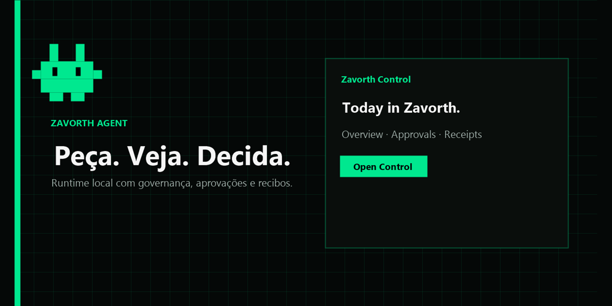
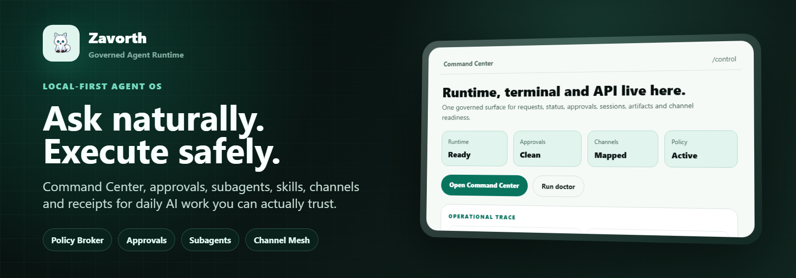
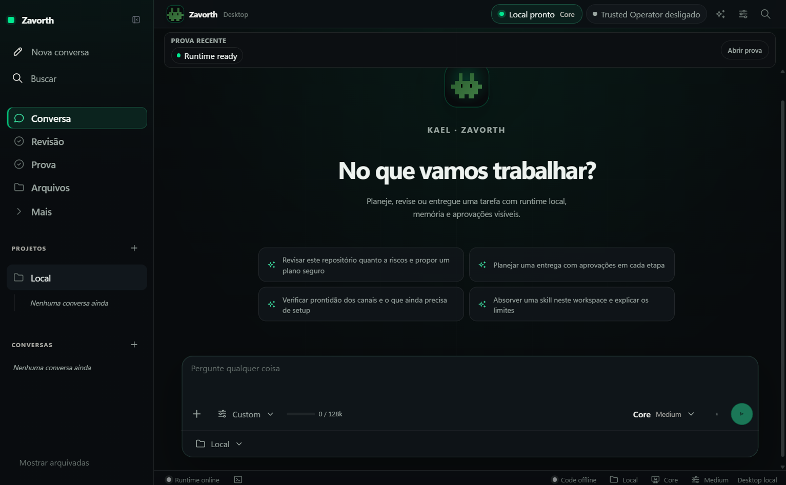

<p align="center">
  
</p>

<p align="center">
  
</p>

<h1 align="center">Zavorth</h1>

<p align="center">
  <strong>Your AI that does things — and proves it.</strong>
</p>

<p align="center">
  Ask naturally. Watch it plan. Approve only real risk.<br/>
  Get receipts for everything that happened.
</p>

<p align="center">
  <a href="https://github.com/zavorth/zavorth/actions"></a>
  <a href="LICENSE"></a>
  <a href="docs/security.md"></a>
  <a href="#-quick-start"></a>
  <a href="https://www.npmjs.com/package/zavorth"></a>
</p>

<p align="center">
  <a href="#-why-zavorth">Why</a> ·
  <a href="#-quick-start">Install</a> ·
  <a href="#-how-it-works">How it works</a> ·
  <a href="#-what-you-get">Features</a> ·
  <a href="#-surfaces">Surfaces</a> ·
  <a href="#-trust-model">Trust</a> ·
  <a href="#-commands">Commands</a> ·
  <a href="#-docs">Docs</a>
</p>

---

> **Talk to it like a colleague.**  
> It listens, plans, asks before acting, and keeps proof of everything.

**Zavorth** is an **MIT-licensed**, local-first AI **agent runtime** — not a chat toy.

You describe work in plain language. Zavorth plans the job, shows what it’s about to do, waits for your approval on anything risky, executes through a governed gateway, and hands you a **receipt**.

No silent takeovers. No surprise shell. No “trust me.”

```text
  you speak  →  zavorth plans  →  you approve  →  it runs  →  you get a receipt
```

---

## ✨ Why Zavorth

<table>
<tr>
<td width="50%" valign="top">

### Built for real work
- Daily ops, code review, research, automation
- Multi-channel inbox when you’re ready
- Desktop app + CLI + Control dashboard
- Skills, plugins, MCP — absorbed under quarantine

</td>
<td width="50%" valign="top">

### Built for real trust
- Preview before execute on sensitive actions
- Scoped, expiring approvals
- Auditable receipts — who / what / when
- Honest readiness (never fake “online”)

</td>
</tr>
</table>

| | **Zavorth** | Typical agent |
|---|---|---|
| **Execution** | Governed gateway + receipts | Run and hope |
| **Approvals** | Per-action, scoped, revocable | All-or-nothing |
| **Memory** | Workspace-scoped, consent-aware | Global free-for-all |
| **Status** | Honest about what’s ready | Pretends everything works |
| **Self-change** | Preview → approve → apply | Instant or unavailable |
| **Multi-agent** | Budgeted, isolated, replayable | Free-for-all |

---

## 🚀 Quick start

**Runtime:** Node.js **18+** (20+ recommended)

```bash
npm install -g zavorth@latest
```

```bash
npx zavorth setup    # guided setup (~30s)
npx zavorth start    # start the local runtime
npx zavorth open     # open Zavorth Control
```

Or jump straight into chat:

```bash
npx zavorth chat
```

**First safe request** (read-only, no side effects):

```text
Review this repository and tell me what is risky.
```

<details>
<summary><b>Windows / PowerShell tip</b></summary>

```powershell
npm install -g zavorth@latest
npx zavorth setup
npx zavorth start
```

</details>

---

## 🔁 How it works

```text
┌──────────────┐     ┌──────────────┐     ┌──────────────┐
│  You speak   │────▶│ Zavorth plans│────▶│   Preview    │
│  natural lang│     │ tools + path │     │ risk surface │
└──────────────┘     └──────────────┘     └──────┬───────┘
                                                 │
                       ┌──────────────┐          │
                       │ You approve  │◀─────────┘
                       │ go / edit /  │
                       │ defer        │
                       └──────┬───────┘
                              │
                       ┌──────▼───────┐     ┌──────────────┐
                       │  Execution   │────▶│   Receipt    │
                       │ governed only│     │ what · when  │
                       └──────────────┘     │ who approved │
                                            └──────────────┘
```

1. **Ask** — Dashboard, CLI, Telegram, API, Desktop  
2. **Plan** — intent, tools, steps  
3. **Preview** — low risk runs fast; sensitive work shows a plan  
4. **Approve** — accept, reject, defer, or grant scoped permission  
5. **Execute** — only through the governed path  
6. **Receipt** — proof you can re-read later  

---

## 🖥 Product surfaces

<p align="center">
  
</p>

| Surface | What it is |
|---|---|
| **Zavorth Control** | Command center for runtime, approvals, sessions, channels |
| **Desktop app** | Native cockpit for daily operator work |
| **CLI** | `setup`, `start`, `chat`, `ask`, `doctor`, fabric commands |
| **Channels** | Telegram first-class; more via packs + honest readiness tiers |
| **API / MCP** | Programmatic control and tool bridging |

<p align="center">
  
</p>

---

## 🧩 What you get

<table>
<tr>
<td width="50%" valign="top">

### 🧭 Daily assistant  
Questions, reminders, files, ops — with a paper trail.

### 🔍 Code review  
Read-only by default. Patches only after you say yes.

### 🧠 Memory  
Learns what matters. Forgets what doesn’t. Scoped to your workspace.

### 📣 Multi-channel  
Honest channel tiers. Catalog ≠ live. Synthesize packs when needed.

</td>
<td width="50%" valign="top">

### 🛡 Approvals & receipts  
Every risky action is visible, gated, and auditable.

### 🔌 Skills on demand  
Absorb skills / plugins / MCP from path, archive, or HTTPS — under quarantine.

### 🤖 Providers  
OpenAI, Anthropic, Gemini, Ollama, OpenRouter, and more.

### 🐝 Swarm  
Multiple agents with budgets, isolation, and replay.

</td>
</tr>
</table>

### Product fabrics

| Fabric | Promise |
|---|---|
| **Capability** | Acquire skills/plugins/MCP on demand — not a static storefront |
| **Reach** | Honest channel + node mesh; never claim live when it’s only catalog |
| **Power** | Elastic backends, trusted operator mode, learning promote, harnesses |
| **Product** | First-run trail, public CLI surface, hermetic `zavorth product certify` |

```bash
zavorth product          # daily readiness
zavorth product certify  # hermetic fabric matrix
zavorth absorb ./pack --preview
zavorth reach
zavorth power
```

---

## 🛡 Trust model

Zavorth is proactive **without** being reckless.

| Guarantee | Detail |
|---|---|
| **Preview before execute** | Sensitive actions show a plan first |
| **Approval gates** | You choose what needs an OK |
| **Receipts** | Clear audit: action, time, result, approver |
| **Scoped permissions** | Time- / action- / channel-bounded; they expire |
| **Break-glass** | Emergencies still audited and revocable |
| **Secrets stay local** | Credentials never dumped into prompts or logs |
| **Status honesty** | Says “not ready” instead of pretending |

---

## ⌨ Commands

| Command | Purpose |
|---|---|
| `zavorth setup` | Guided providers, channels, safety |
| `zavorth start` | Start the local runtime |
| `zavorth open` | Open Zavorth Control |
| `zavorth chat` | Terminal chat session |
| `zavorth ask "..."` | One-shot governed request |
| `zavorth product` | Product readiness + first-run trail |
| `zavorth product certify` | Hermetic certification of all fabrics |
| `zavorth absorb <source>` | Absorb skill/plugin/MCP (preview first) |
| `zavorth import-workspace <path>` | Structural import from any agent home |
| `zavorth reach` | Channel tiers + node inventory |
| `zavorth power` | Elastic backends, trusted mode, learning |
| `zavorth providers` | Provider readiness |
| `zavorth channels telegram` | Connect a first-class channel |
| `zavorth trust` | Inspect approval posture |
| `zavorth proof` | Proof ledger (list / show / export receipts) |
| `zavorth doctor` | Diagnose issues |

Trust-loop gate (hermetic): `npm run qa:zavorth-golden-path` — see [docs/product/golden-path.md](docs/product/golden-path.md). Pre-ship: `npm run qa:zavorth-release-hardening`.

Full public catalog:

```bash
zavorth product commands
```

---

## 📚 Docs

| Guide | Link |
|---|---|
| Quickstart | [docs/quickstart.md](docs/quickstart.md) |
| Capabilities | [docs/capabilities.md](docs/capabilities.md) |
| Architecture | [docs/architecture.md](docs/architecture.md) |
| Security | [docs/security.md](docs/security.md) |
| Channels | [docs/telegram.md](docs/telegram.md) |
| Dashboard | [docs/web-dashboard.md](docs/web-dashboard.md) |
| CLI | [docs/zavorth-cli.md](docs/zavorth-cli.md) |
| Skills | [docs/skills.md](docs/skills.md) |
| Self-modification | [docs/self-modification.md](docs/self-modification.md) |
| Operations | [docs/operations.md](docs/operations.md) |

---

## 🏗 Project layout

```text
zavorth/
├── apps/zavorth-desktop/   # Electron desktop cockpit
├── assets/brand/           # README & social brand kit
├── docs/                   # Product & operator docs
├── src/                    # Runtime, gateways, services, CLI
├── tests/                  # CI groups (security, channels, …)
└── package.json            # zavorth CLI + runtime
```

---

## 🤝 Contributing

Issues and PRs are welcome. Keep changes focused, avoid secrets in commits, and prefer small, reviewable diffs.

- Security concerns → see [SECURITY.md](SECURITY.md)
- Code of conduct → be excellent to each other

```bash
git clone https://github.com/zavorth/zavorth.git
cd zavorth
npm install
npm run runtime:check
```

---

## 📜 License

[MIT](LICENSE) — free to use, fork, and ship.

---

<p align="center">
  
</p>

<p align="center">
  <sub>
    Built with <b>local control</b>, <b>explicit trust</b>, and <b>visible receipts</b>.
  </sub>
</p>

<p align="center">
  <a href="https://github.com/zavorth/zavorth/stargazers">⭐ Star Zavorth</a>
  &nbsp;·&nbsp;
  <a href="https://github.com/zavorth/zavorth/issues">Open an issue</a>
  &nbsp;·&nbsp;
  <a href="docs/quickstart.md">Read the quickstart</a>
</p>
