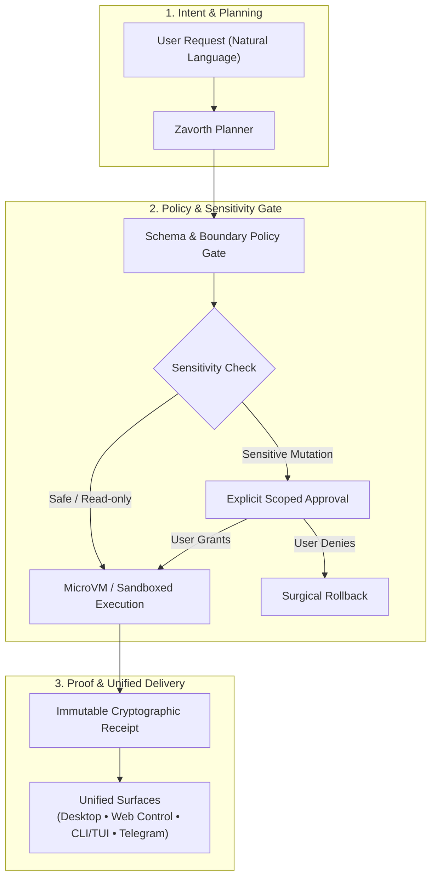

<p align="center">
  
</p>

# Zavorth 🛡️

<p align="center">
  <a href="docs/quickstart.md">Quickstart</a> •
  <a href="docs/desktop.md">Zavorth Desktop</a> •
  <a href="docs/web-zavorthControl.md">Zavorth Control</a> •
  <a href="docs/zavorth-cli.md">CLI Reference</a> •
  <a href="docs/security.md">Security Model</a>
</p>

<p align="center">
  <a href="docs/quickstart.md"></a>
  
  
  <a href="docs/security.md"></a>
  
  <a href="LICENSE"></a>
</p>

<p align="center">
  
  
</p>

**The governed autonomous AI agent runtime built for real work.** Zavorth connects the same governed agent across Desktop, Zavorth Control (Web), interactive CLI/TUI, and remote channels with scoped approvals, MicroVM sandbox isolation, and cryptographic execution proofs. Ask naturally, approve only real risk, and keep immutable receipts for every run.

Use any model you want — **OpenAI**, **Anthropic**, **Google Gemini**, **Ollama**, **OpenRouter**, and custom local endpoints. Switch seamlessly with `zavorth providers` — zero code changes, zero vendor lock-in.

---

<table>
<tr><td width="30%"><b>🛡️ Governed Execution</b></td><td>Schema policy gates, MicroVM isolation, and explicit, scoped, expiring human approvals before any sensitive file or system mutation.</td></tr>
<tr><td><b>📜 Cryptographic Receipts</b></td><td>Every run produces an immutable proof (<code>receipts/</code>) capturing exact parameters, timestamps, execution diffs, and verification hashes.</td></tr>
<tr><td><b>🖥️ Multi-Surface Truth</b></td><td>Shared runtime state across Desktop App, Zavorth Control Web dashboard, interactive keyboard-first CLI/TUI, and Telegram gateway.</td></tr>
<tr><td><b>🧠 Scoped Memory & Soul</b></td><td>Workspace-scoped, consent-aware knowledge and persona curation (<code>SOUL.md</code>, <code>IDENTITY.md</code>, <code>MEMORY.md</code>) without global prompt contamination.</td></tr>
<tr><td><b>🔄 Controlled Self-Mod</b></td><td>Preview-first self-improvement via <code>/selfmod</code> with syntax validation, diff inspection, and instant one-command surgical rollback.</td></tr>
<tr><td><b>🔌 Pluggable Architecture</b></td><td>Extensible tool runtime supporting Model Context Protocol (MCP), Playwright browser automation, native computer use, and custom skills.</td></tr>
<tr><td><b>⚡ Local-First & Private</b></td><td>Runs 100% on your own machine. Secrets and tokens stay in local secure vaults, never bundled or leaked in telemetry.</td></tr>
</table>

---

## ⚡ Start Fast

Requires Node.js 18 or newer (Node.js 20+ LTS recommended).

```bash
# Global installation
npm install -g zavorth@latest

# Bootstrap runtime & open Control dashboard
zavorth setup
zavorth start
zavorth open
```

`zavorth open` launches the official Control dashboard in your browser at `/control` (`/zavorthControl` remains supported as a legacy route).

Start an interactive terminal conversation at any time:

```bash
zavorth chat
```

For setting up a fresh workspace, follow the [BOOTSTRAP.md](BOOTSTRAP.md) guide. For every CLI command and TUI workflow, see [docs/zavorth-cli.md](docs/zavorth-cli.md).

---

## 🛡️ Governed Execution Lifecycle



---

## 🔍 Why Zavorth? (Governed Runtime vs Generic Agents)

| Capability | Generic AI Agents (Raw Shell / Wrappers) | 🛡️ Zavorth Governed Runtime |
| :--- | :--- | :--- |
| **Command Execution** | Unrestricted shell access with blind execution | **Strict MicroVM isolation & Schema policy gates** |
| **Sensitive Actions** | Executes mutations without human oversight | **Explicit, scoped, expiring human approvals** |
| **Auditability & Proof** | Ephemeral, lost terminal stdout | **Immutable cryptographic receipts (<code>receipts/</code>)** |
| **Memory Management** | Global uncurated prompt dumping | **Workspace-scoped, consent-aware, inspectable** |
| **Unified Surfaces** | Fragmented CLI scripts | **Synchronized Desktop, Web Control, CLI, & Telegram** |
| **Self-Evolution** | Uncontrolled overwrites | **Preview-first self-modification with instant rollback** |

---

## 🖥️ Surfaces & Interfaces

| Surface | Focus & Best For |
|---|---|
| **Desktop App** | Daily chat, file navigation, workboard, automations, live approvals, receipts, and settings. |
| **Zavorth Control** | Operations center, provider telemetry, active channels, node orchestration, and diagnostics. |
| **CLI / TUI** | High-speed setup, keyboard-first development, system repair, and background scripting. |
| **Remote Channels** | Governed interaction through Telegram and supported enterprise communication channels. |

The Desktop keeps terminal output and execution logs inside a deliberate, structured workspace rail rather than floating over unrelated windows.

---

## 🔒 Trust & Security Architecture

Zavorth treats model output, tool output, retrieved web content, and channel messages as untrusted until validated through boundary schemas. High-risk execution uses the strongest available sandbox and fails closed when isolation is unavailable. Secrets remain exclusively in secure local configuration, never in prompts, receipts, or client bundles.

Essential operational commands:

```bash
zavorth status        # Inspect runtime health and provider statuses
zavorth doctor        # Run automated environment diagnostics and repairs
zavorth providers     # Manage pluggable LLM backends (OpenAI, Anthropic, Ollama, etc.)
zavorth capabilities  # List active tools, skills, and sandboxes
zavorth approvals     # Audit pending and past permission requests
zavorth receipts      # Inspect verifiable execution proofs
```

---

## 🔄 Controlled Self-Modification

All runtime modifications and agent self-improvements are **preview-first**. A proposed change is never written to disk until an authorized user explicitly reviews and applies it.

```text
/selfmod <relative_file> -- <instruction>
/selfmod goal -- <goal>
/selfmod apply <preview_id>
/selfmod rollback <change_id>
```

See [docs/self-modification.md](docs/self-modification.md) for authorization, safety bounds, rollback mechanics, and audit behavior.

---

## 📚 Documentation Index

- 🚀 [Quickstart Guide](docs/quickstart.md)
- ⌨️ [CLI & TUI Reference](docs/zavorth-cli.md)
- 🖥️ [Desktop Experience Guide](docs/desktop.md)
- 🎛️ [Zavorth Control Architecture](docs/web-zavorthControl.md)
- 🛡️ [Security & Governance Model](docs/security.md)
- 🏛️ [Core Architecture](docs/architecture.md)
- 🧭 [Product Direction & Roadmap](docs/product-direction.md)
- 🔧 [Operations & Maintenance](docs/operations.md)
- 🤝 [Contributing Guidelines](CONTRIBUTING.md)

---

## 🛠️ Local Development & Testing

```bash
# Install dependencies
npm install

# Run complete test suite (typecheck, security gates, unit, integration)
npm test
```

The repository enforces dedicated type, architecture, security, visual, accessibility, and cross-surface gates before any change is merged.

---

## 📄 License

MIT — see [LICENSE](LICENSE) for full details.
