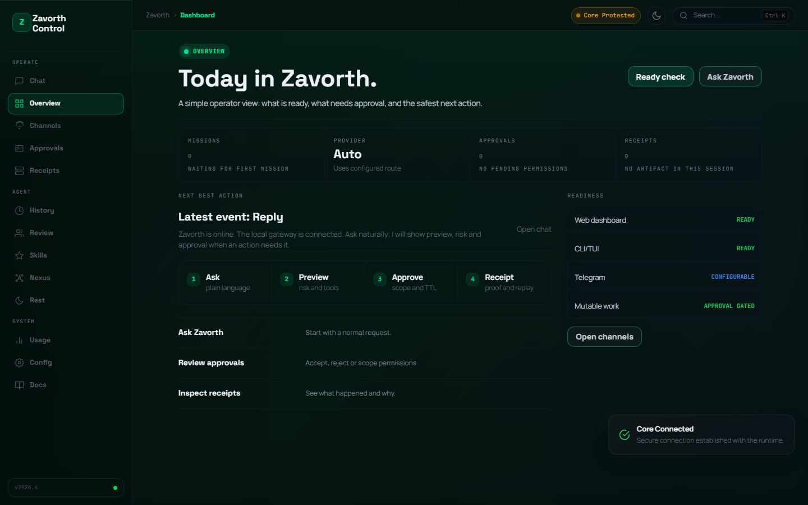

<div align="center">
  

  <h1>Zavorth</h1>

  <p>
    <strong>A local operating system for AI agents.</strong>
  </p>

  <p>
    Ask in natural language, connect your tools and providers, let Zavorth plan
    the work, approve real risk, and keep a clear trail of what happened.
  </p>

  <p>
    <a href="LICENSE"></a>
    <a href="docs/security.md"></a>
    <a href="docs/operations.md"></a>
    <a href="docs/zavorth-cli.md"></a>
  </p>

  <p>
    <a href="#start-fast">Start Fast</a> |
    <a href="#what-zavorth-does">What It Does</a> |
    <a href="#product-surface">Product Surface</a> |
    <a href="#daily-operator-flow">Daily Flow</a> |
    <a href="#command-map">Commands</a> |
    <a href="#trust-model">Trust Model</a> |
    <a href="#repo-map">Repo Map</a> |
    <a href="docs/README.md">Docs</a>
  </p>
</div>

---

## What Zavorth Is

Zavorth is a local operating system for AI agents. It receives natural language,
classifies intent, chooses the right provider, tool, channel, memory or worker,
and routes action through policy before anything sensitive happens.

It is built for users who want an agent that can be useful every day without
silently taking unlimited control of their machine.

## Start Fast

Install the current CLI:

```bash
npm install -g zavorth@latest
```

For a local checkout:

```bash
npm install
npx zavorth setup
npx zavorth start
npx zavorth open
```

The primary user surface is `/dashboard`: configure with `zavorth setup`, start
the local runtime with `zavorth start`, then open it with `zavorth open` for
readiness, providers, approvals, receipts, skills, review, memory, and daily
operator work.

For terminal-first use:

```bash
npx zavorth chat
npx zavorth providers
npx zavorth providers add
npx zavorth channels telegram
npx zavorth status
npx zavorth ready
npx zavorth ready --product
npx zavorth trust
```

For the safest first run, open the Dashboard, connect a provider, review the
readiness state, then send one normal request:

```text
Review this repository and tell me what is risky.
```

## Product Surface

The Dashboard is the main operating surface. It is designed around one daily
loop: ask for the outcome, let Zavorth prepare the work, approve only real risk,
then review the result.

<p align="center">
  
</p>

## What Zavorth Does

| Surface | What it gives you |
| --- | --- |
| Natural First Runtime | Free text enters the agent gateway instead of dying in a shallow command path. |
| Dashboard | Operator home for readiness, approvals, providers, receipts, tasks, skills, and review. |
| CLI/TUI | A daily terminal app for chat, status, smart commands, provider state, approvals, tasks, voice, sandbox, and logs. |
| Telegram and channels | Remote operation with governed approvals, receipts, and channel-aware responses. |
| Satellite Companion | Pairing, remote approval cards, offline queue, wake/voice readiness, and local-node status. |
| Provider Catalog | A large provider and model catalog with readiness, fallbacks, and safe status. |
| Mnemos | Scoped local memory and universal file understanding for documents, PDFs, images, and archives. |
| Echo | Voice and TTS control surface with clear provider readiness. |
| Nexus | Integration and connector map for the user's local environment. |
| Swarm v2 | Multi-agent work planning with budgets, isolation policies, replay, and synthesis. |
| Agent Review | Read-only code review by default, with patch application separated behind approval. |
| Skill Ecosystem | Zavorth-native skills, routing, curation, quality scoring, and approval-based evolution. |
| Transaction Plane | Transaction preview, mandate checks, approval, ledger, simulation, and live execution gates. |

## Daily Operator Flow

1. Ask naturally in the Dashboard, CLI, Telegram, or API.
2. Zavorth classifies the request as chat, memory, review, skill, tool, provider, approval, or execution.
3. Low-risk work responds quickly. Sensitive work becomes a preview.
4. You approve, reject, defer, or grant a scoped permission.
5. Zavorth executes only through the governed gateway.
6. Receipts, ledger entries, and memory updates explain what happened.
7. You can review, revoke, replay, or roll back where a rollback path exists.

## Command Map

| Command | Purpose |
| --- | --- |
| `zavorth setup` | Guided First Light flow for provider, model, channels, Mnemos, and safety. |
| `zavorth start` | Start or resume the local runtime and make `/dashboard` available. |
| `zavorth open` | Open the local Dashboard with the current access token. |
| `zavorth ready` | One command operator readiness check. |
| `zavorth ready --product` | Product certification for setup, providers, channels, dashboard, TUI and clean home isolation. |
| `zavorth status` | Show current health. |
| `zavorth providers` | Show provider and model readiness. |
| `zavorth providers add` | Guided provider/API key/model wizard with redacted secrets. |
| `zavorth providers switch` | Change the default provider/model through the same safe wizard. |
| `zavorth channels telegram` | Guided channel wizard for Telegram token, allowlist and readiness. |
| `zavorth channels discord` | Guided channel wizard for Discord token, guild/channel policy and readiness. |
| `zavorth skills` | Inspect native skill coverage and curator hints. |
| `zavorth review` | Run governed agent review. |
| `zavorth trust` | Inspect approval posture, persistent permissions, and break-glass controls. |
| `zavorth doctor` | Diagnose setup/runtime issues and show the next safe action. |

Maintainers can run the full product gate before publishing:

```bash
npm run release:check
```

## Trust Model

Zavorth is designed to be proactive without becoming reckless.

- Sensitive actions require policy, preview, approval, and receipt.
- Natural approval is supported, but risky grants stay scoped by time, action, channel, and limit.
- Break-glass mode exists for extreme cases, but it is still explicit, audited, revocable, and guarded.
- Secrets are handled as references and must not be serialized into prompts, logs, receipts, or screenshots.
- Providers, sandboxes, channels, and skills are configurable capabilities, not silent dependencies.
- Providers are cataloged honestly: configured and proven routes are marked ready; missing credentials stay "not configured".
- Transaction and execution flows prefer simulation, preview, and audit before any live operation.

## Repo Map

| Path | Role |
| --- | --- |
| `src/` | Core runtime, services, providers, gateways, policy, and dashboard integration. |
| `scripts/` | Operator commands, readiness checks, release utilities, and local tooling. |
| `tests/` | Unit, runtime, security, gateway, provider, dashboard, and skill checks. |
| `docs/` | Product docs, architecture notes, security posture, operations, and roadmap. |
| `skill-library/` | Native skills, governed curation inputs, and approved skill surfaces. |
| `assets/` | Brand, dashboard, social, and repository presentation assets. |
| `agent/` | Runtime-side agent support and voice/media helpers. |
| `apps/` | Application surfaces and companion app code. |
| `data/` | Local receipts, state snapshots, and runtime artifacts. |

## Status Honesty

Zavorth can know about a provider, channel, backend, or skill without pretending
it is live. A route can be available for execution while still asking for the
credential, endpoint, policy, or live proof that your machine has not provided
yet.

That means the repo may show many cataloged routes while only a subset is
active on a specific machine. This is intentional: it keeps setup simple, avoids
false readiness, and prevents accidental execution with missing credentials.

## Documentation

- [Documentation index](docs/README.md)
- [Quickstart](docs/quickstart.md)
- [Capabilities](docs/capabilities.md)
- [Architecture](docs/architecture.md)
- [Security](docs/security.md)
- [Telegram](docs/telegram.md)
- [Dashboard](docs/web-dashboard.md)
- [CLI guide](docs/zavorth-cli.md)
- [Operations](docs/operations.md)
- [Capability mesh](docs/capability-mesh.md)
- [Product Principles](docs/product-direction.md)
- [Product Certification](docs/product-certification.md)
- [Self-modification guide](docs/self-modification.md)

### Self-modification commands
- preview: docs/self-modification.md
- /selfmod <relative_file> -- <instruction>
- /selfmod goal -- <goal>
- /selfmod apply <preview_id>

---

<div align="center">
  <sub>Zavorth is built for autonomous work with local control, explicit trust, and visible receipts.</sub>
</div>
