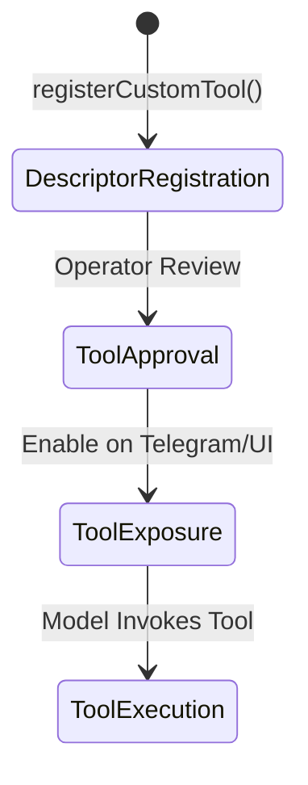

# Extension Facade Design

> [!NOTE]
> This is a durable design document for Zavorth.

## API Shape Design

Zavorth uses a type-safe `ZavorthExtensionFacade` to declare and configure custom tools dynamically.

```typescript
export type CustomToolRiskClass = 'safe' | 'low' | 'medium' | 'high' | 'critical' | 'unknown';

export type CustomToolDescriptor = {
  namespace: string;
  name: string;
  description: string;
  inputSchema: unknown;
  capabilities: string[];
  riskClass?: CustomToolRiskClass;
  handler?: unknown;
  metadata?: Record<string, unknown>;
};

export class ZavorthExtensionFacade {
  /**
   * Registers a custom tool into the runtime.
   * Note: Registration only declares the tool to the engine. It does not activate it.
   */
  public static registerCustomTool(descriptor: CustomToolDescriptor): ExtensionRegistrationResult;
}
```

---

## Safety Invariants of the Facade

The `ZavorthExtensionFacade` is designed to reduce developer boilerplate, but it **must not** bypass the security architecture. Specifically, the facade:
*   **Must Not Sign Trust Automatically**: Registering a descriptor places the tool in a quarantined/unapproved pool. The system will never mark it as trusted without explicit user confirmation.
*   **Must Not Activate Critical Tools Automatically**: Any tool with `riskClass` other than `safe` must remain in `pending_approval` state until the operator completes the manual approval flow.
*   **Must Not Bypass the ToolGatekeeper**: Every invocation from a model is checked by the `ToolGatekeeper`, validating signatures and input schemas.
*   **Must Not Bypass Approval Gates**: Safe command execution caches (leases) cannot be configured or granted by the facade itself.
*   **Must Not Expose Tools to Unauthorized Channels**: Exposing the tool to specific input surfaces (e.g. Telegram webhook routing) requires matching policy manifest declarations.
*   **Must Not Hide Capabilities**: The tool's capabilities are fully inspected by the policy service during startup.
*   **Must Reject Obvious Secrets**: Recursive validation is performed during registration to scan for raw keys, tokens, or credentials in metadata and immediately reject them.

---

## Fingerprinting and Drift Protection

To prevent runtime modification of custom tools (e.g. an extension changing its code or capabilities dynamically after approval), the facade computes a stable SHA-256 fingerprint based on safety-relevant properties:
1.  Namespace (normalized)
2.  Name (normalized)
3.  Input Schema (recursively sorted and canonicalized)
4.  Capabilities (sorted)
5.  Risk Class

If a tool with the same qualified name is registered with a different fingerprint:
*   The system detects a **signature drift**.
*   The existing approval status is invalidated.
*   The tool is marked as `drift_detected` and returned to quarantine, requiring new operator validation.
*   A secure audit event is written immediately.

---

## Operational Terminology

To prevent security misalignments, we define distinct phases in a tool's lifecycle:



1.  **Descriptor Registration**: The extension tells the Zavorth runtime that the tool exists, what parameters it accepts, and what capabilities it needs. The tool is placed in quarantine (`registered_unapproved` or `pending_approval`).
2.  **Tool Approval**: The operator audits the code/manifest and approves the tool. This changes the status to `approved`.
3.  **Tool Exposure**: The runtime decides which channels (CLI, Dashboard, Telegram) are allowed to trigger the tool based on active channel policies.
4.  **Tool Execution**: The model triggers the tool, the `ToolGatekeeper` verifies the parameters, the sandbox runs the handler, and an audit receipt is written.
