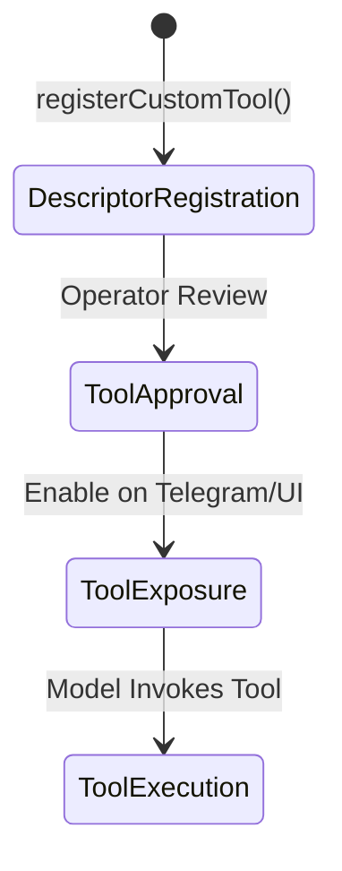

# Extension Facade Design

> [!NOTE]
> This is a durable design document for Zavorth.

## Future API Shape Design

The future `ZavorthExtensionFacade` will expose a clean, type-safe API for registering custom tools. A draft representation of the registration method is:

```typescript
export interface CustomToolDescriptor {
  /** Unique namespace identifier (e.g. 'workspace_manager') */
  namespace: string;
  
  /** Name of the tool (e.g. 'clean_temp_files') */
  name: string;
  
  /** Description explaining what the tool does and when it should be called */
  description: string;
  
  /** JSON Schema/Zod object defining the required parameters */
  inputSchema: Record<string, unknown>;
  
  /** Declared system capabilities required (e.g., 'filesystem.read', 'network') */
  capabilities: string[];
  
  /** Statically defined risk class ('low' | 'medium' | 'high' | 'critical') */
  riskClass: 'low' | 'medium' | 'high' | 'critical';
  
  /** Cryptographic hash of the tool's handler code on disk */
  fingerprint: string;
  
  /** The actual handler function executed inside the sandbox boundary */
  handler: (params: Record<string, unknown>) => Promise<Record<string, unknown>>;
}

export class ZavorthExtensionFacade {
  /**
   * Registers a custom tool into the runtime.
   * Note: Registration only declares the tool to the engine. It does not activate it.
   */
  public static registerCustomTool(descriptor: CustomToolDescriptor): void {
    // Design-only: In future implementation, this will:
    // 1. Verify that namespace prefix does not collide with system keywords.
    // 2. Validate inputSchema formatting.
    // 3. Register the tool in the ToolGatekeeper in a 'quarantined' state.
    // 4. Log the audit event: 'extension_tool_registered'
  }
}
```

---

## Safety Invariants of the Facade

The `ZavorthExtensionFacade` is designed to reduce developer boilerplate, but it **must not** bypass the security architecture. Specifically, the facade:
- **Must Not Sign Trust Automatically**: Registering a descriptor places the tool in a quarantined pool. The system will never mark it as trusted without explicit user confirmation.
- **Must Not Activate Critical Tools Automatically**: Any tool with `riskClass: 'high'` or `'critical'` must remain disabled until the operator completes the manual approval flow.
- **Must Not Bypass the ToolGatekeeper**: Every invocation from a model is checked by the `ToolGatekeeper`, validating signatures and input schemas.
- **Must Not Bypass Approval Gates**: Safe command execution caches (leases) cannot be configured or granted by the facade itself.
- **Must Not Expose Tools to Unauthorized Channels**: Exposing the tool to specific input surfaces (e.g. Telegram webhook routing) requires matching policy manifest declarations.
- **Must Not Hide Capabilities**: The tool's capabilities are fully inspected by the `ProfileManifestService` during startup.

---

## Operational Terminology

To prevent security misalignments, we define distinct phases in a tool's lifecycle:



1.  **Descriptor Registration**: The extension tells the Zavorth runtime that the tool exists, what parameters it accepts, and what capabilities it needs. The tool is placed in quarantine.
2.  **Tool Approval**: The operator audits the code/manifest and approves the tool. This changes the status from `quarantined` to `approved`.
3.  **Tool Exposure**: The runtime decides which channels (CLI, Dashboard, Telegram) are allowed to trigger the tool based on active channel policies.
4.  **Tool Execution**: The model triggers the tool, the `ToolGatekeeper` verifies the parameters, the sandbox runs the handler, and an audit receipt is written.
