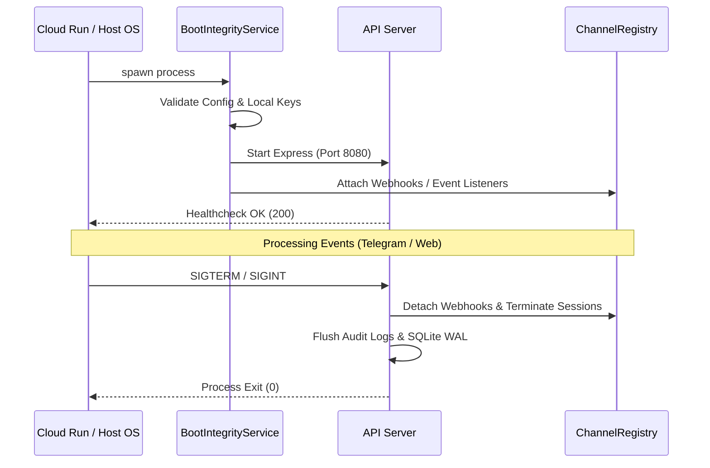

# Headless & Serverless Architecture - Phase 21S-A

> [!IMPORTANT]
> This is a design-only document for Phase 21S-A. No runtime implementation is performed in this phase.

## Future Headless Mode Design
The future `--headless` flag on `zavorth start` will configure the runtime to boot without spawning the Electron-based GUI Dashboard. Instead, the backend will initialize only the following core engines:
- **Express/Vite API Server**: Listens on the configured port (`config.zavorthAIGatewayGatewayPort`).
- **Channel Registry**: Establishes connections for enabled external surfaces (such as Telegram webhooks).
- **Core Orchestrator**: Handles the agent execution loops in the background.

## Startup and Shutdown Lifecycle

## HTTP Healthcheck
- The headless runtime will expose a healthcheck endpoint at `/health` returning `200 OK`.
- Cloud platforms (like AWS Lambda or Google Cloud Run) will poll this endpoint to determine container readiness.

## Webhook Route Boundaries & Verification
- All external message channels (e.g. Telegram, Discord) will route inbound updates through a dedicated POST path `/api/webhook/:channelId`.
- The webhook endpoint must verify the request's origin signature (e.g. `X-Telegram-Bot-Api-Secret-Token`) before processing the body to prevent unauthorized payload injections.

## Secret Handling & Safe Logging
- Secrets (API keys, database tokens) must never be logged to stdout or stderr.
- All logs printed by `SecurityAuditLogger` in headless mode must undergo redaction via `redactSecrets(...)`.
- Env variables and API credentials are kept in memory and never written to temporary files on disk.

## Cold Start & Ephemeral Filesystem Concerns
- In serverless environments, cold starts can take 1-3 seconds. The boot process must be kept minimal (deferred initialization of non-essential services).
- **Ephemeral Filesystem**: Any files written to disk inside the container (e.g., in `/tmp`) are lost when the instance scales down to zero. State must be externalized.
- **Workspace Limitations**: Without a persistent local workspace, file editing commands must operate on a synced virtual copy or a mounted remote workspace directory.

## Approval UX in Headless Mode
- Since no local dashboard screen exists in headless mode, approvals must be handled remotely.
- **Remote Approvals**: Approvals will be routed as message cards with action buttons to Telegram/Slack, or served via a secure tunnel `/control` route using the `ZavorthBridgePublicTunnelService`.

## Safe Defaults and Exclusions
To maintain safety during the transition phase, the following features **remain disabled** in headless mode until later phases:
- File mutations outside the active workspace directory.
- Direct root shell access.
- Auto-execution of quarantined tools without prior database-backed approval records.
