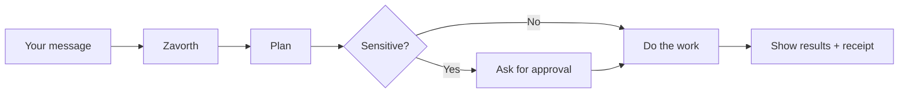

# Zavorth 🦊

<p align="center">
  <strong>Your AI. Your machine. Your rules.</strong><br />
  Chat with Zavorth from Telegram, Discord, WhatsApp, Slack, or your browser — and it does real work, on your computer, while you stay in control.
</p>

<Columns>
  <Card title="Get started" href="/docs/produto/start/getting-started" icon="rocket">
    Install Zavorth and chat with it in under 5 minutes.
  </Card>
  <Card title="Primeiro uso" href="/docs/produto/start/primeiro-uso" icon="play">
    Um caminho simples para instalar, abrir o chat, conectar um modelo e entender aprovacoes.
  </Card>
  <Card title="Set it up your way" href="/docs/produto/start/onboarding" icon="sparkles">
    Give Zavorth a name, a personality, and your preferred language.
  </Card>
  <Card title="Open the dashboard" href="/docs/produto/interfaces/zavorthcontrol" icon="layout-dashboard">
    See what Zavorth is doing, approve tasks, and review results.
  </Card>
</Columns>

## What is Zavorth?

Zavorth is a **self-hosted AI assistant** that lives on your computer and talks through the apps you already use — Telegram, Discord, WhatsApp, Slack, your browser, or the terminal.

You send a message. Zavorth figures out what you need, does the work, and shows you what it did before anything changes on your machine.

**Who is it for?** Anyone who wants an AI assistant that is actually useful — not a chatbot that guesses, but one that executes, remembers, and asks when it is not sure.

**What makes Zavorth useful every day?**

- **It runs on your machine** — your data stays with you, always
- **It asks before it acts** — sensitive actions get a review step you can approve or reject
- **It remembers across sessions** — not just this conversation, but decisions from last week
- **It works from anywhere** — Telegram on your phone, Discord on your computer, or a browser tab
- **You can use any AI model** — Gemini, Claude, GPT-4o, DeepSeek, or a local model running on your machine

## How it works



You talk to Zavorth through whatever channel you prefer. It builds a plan, checks if anything is risky, and either does it or asks you first. Everything it does leaves a record.

## What Zavorth can do

<Columns>
  <Card title="Any channel" icon="message-square" href="/docs/produto/canais">
    Telegram, Discord, WhatsApp, Slack, Signal, iMessage, Teams, Email, and more.
  </Card>
  <Card title="Any AI model" icon="cpu" href="/docs/produto/providers">
    Gemini, GPT-4o, Claude, DeepSeek, local models — switch anytime without restarting.
  </Card>
  <Card title="Skills" icon="wrench" href="/docs/produto/skills">
    Install ready-made skills or teach Zavorth new ones. It learns from your workflows.
  </Card>
  <Card title="Memory" icon="brain" href="/docs/produto/conceitos/memoria">
    Zavorth remembers past decisions, project context, and your preferences — across sessions.
  </Card>
  <Card title="Your identity" icon="user" href="/docs/produto/conceitos/identidade">
    Give it a name, a personality, and a working style. It stays consistent everywhere.
  </Card>
</Columns>

## Quick start

<Steps>
  <Step title="Install Zavorth">
    ```bash
    npm install -g zavorth@latest
    ```
    Or with the one-line installer:
    ```bash
    # macOS / Linux
    curl -fsSL https://zavorth.ai/install.sh | bash

    # Windows (PowerShell)
    irm https://zavorth.ai/install.ps1 | iex
    ```
  </Step>
  <Step title="Run setup">
    ```bash
    zavorth setup
    ```
    This walks you through picking a model, setting your API key, and calibrating Zavorth's personality — about 3 minutes.
  </Step>
  <Step title="Start and open">
    ```bash
    zavorth start
    zavorth open
    ```
    The dashboard opens in your browser. Send a message and you're in.
  </Step>
</Steps>

Want the full guide? See [Getting started](/docs/produto/start/getting-started).

## Start here

<Columns>
  <Card title="Docs overview" href="/docs/produto/start/what-is-zavorth" icon="book-open">
    Everything you need to know, in plain language.
  </Card>
  <Card title="Primeiro uso" href="/docs/produto/start/primeiro-uso" icon="play">
    O caminho feliz para instalar, conversar, conectar e revisar.
  </Card>
  <Card title="Connect a channel" href="/docs/produto/canais" icon="message-square">
    Telegram, Discord, WhatsApp, Slack, and more.
  </Card>
  <Card title="Choose a model" href="/docs/produto/providers" icon="cpu">
    Gemini, Claude, GPT-4o, DeepSeek, or a local model.
  </Card>
  <Card title="Browse skills" href="/docs/produto/skills" icon="package">
    Ready-made and custom skills.
  </Card>
  <Card title="Full feature list" href="/docs/produto/conceitos/features" icon="list">
    Every capability in one place.
  </Card>
  <Card title="Troubleshooting" href="/docs/produto/ajuda/troubleshooting" icon="life-buoy">
    Something not working? Start here.
  </Card>
</Columns>
