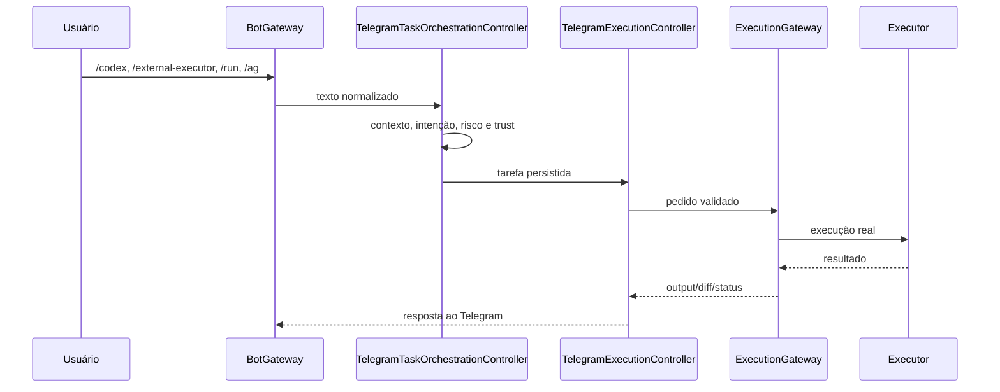
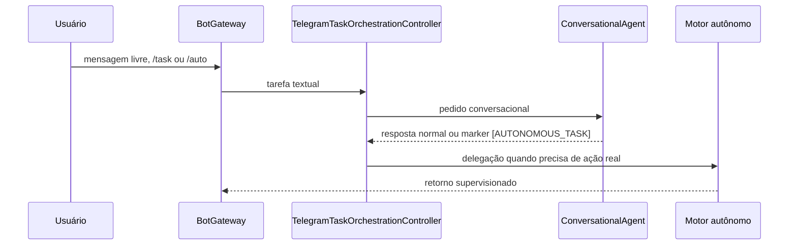
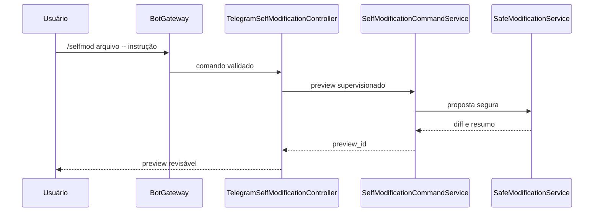

# Arquitetura do Projeto: Zavorth

**Versão:** 2.0  
**Status:** Runtime atual em produção local  
**Data:** 24 de março de 2026  

---

## 1. Visão Geral

O **Zavorth** é um orquestrador local-first controlado principalmente por Telegram. Ele recebe mensagens, mídia e callbacks, classifica o pedido, escolhe o caminho certo entre conversa, planejamento, execução explícita ou automação assistida, e só então aciona executores reais com contenção.

O runtime atual não usa mais `BotClient`, `AgentController`, `TelegramInputHandler` nem `AgentLoop` como caminho oficial. A fonte de verdade hoje é o bootstrap em `src/index.ts`, a gateway `BotGateway` e os controllers especializados da pasta `src/telegram/controllers`.

---

## 2. Princípios

| Princípio | Descrição |
|---|---|
| Local-first | Banco, contexto, permissões, artefatos e integrações sensíveis ficam na máquina do operador. |
| Menor privilégio | Workspace, modo operacional, políticas e permissões limitam a execução por padrão. |
| Execução explícita | Comandos como `/codex`, `/external-executor`, `/run`, `/ag` e `/selfmod` seguem trilhas claras e auditáveis. |
| Conversa com contenção | Pedidos livres podem conversar e planejar, mas só escalam para ação real quando o runtime decide isso de forma controlada. |
| Observabilidade | Logs, auditoria, métricas, permissões e estado operacional ficam acessíveis ao operador. |

---

## 3. Componentes Principais

### 3.1 Bootstrap

`src/index.ts` monta o runtime nesta ordem:

1. `Database`, `LogRepository` e `TaskRepository`
2. `TaskManager`
3. `ToolRegistry` e `ToolExecutor`
4. `Monitor` e `RecoveryManager`
5. `BotGateway`
6. Watchers auxiliares do ZavorthBridge e bridges locais

### 3.2 Telegram

`src/telegram/BotGateway.ts` é a gateway oficial do Telegram. Ele:

- aplica `AuthGuard`
- registra handlers de texto, mídia, callbacks e eventos de grupo
- instancia os controllers especializados
- faz broadcasts role-aware para admins e operadores

Controllers relevantes:

- `TelegramTaskOrchestrationController`
- `TelegramExecutionController`
- `TelegramSelfModificationController`
- `TelegramHubController`
- `TelegramPermissionController`
- `TelegramZavorthBridgeController`
- `TelegramOpsController`

### 3.3 Orquestração

O núcleo de estado fica em `src/orchestrator`:

- `TaskManager` cria, persiste e avança tarefas
- `ContextManager` reaproveita contexto recente do mesmo usuário
- `IntentRouter` escolhe intenção e workspace sugerido
- `RiskClassifier` estima risco e necessidade de aprovação
- `RecoveryManager` trata tarefas zumbis ou pendências no boot

### 3.4 Execução

`src/execution/ExecutionGateway.ts` é o ponto único de execução explícita. Ele conversa com:

- `LocalExecutor`
- `CodexExecutor`
- `ExternalExecutorExecutor`

Essa camada também concentra diff, rollback, backup e aplicação segura de artefatos.

### 3.5 Segurança

As decisões de contenção são distribuídas entre:

- `TrustedBoundary`
- `PolicyEngine`
- `DangerousCommandBlocker`
- `WorkspaceResolver`
- `WorkspaceGuard`
- `PathValidator`
- `SecurityLockService`
- `PermissionService`

### 3.6 Serviços e integrações

`src/services` concentra capacidades transversais:

- `DashboardService`
- `SelfModificationCommandService`
- `SafeModificationService`
- `RemoteModeManager`
- `WslControlService`
- `MemoryService`
- serviços de grupo, moderação e observabilidade

Integrações ativas:

- Codex CLI local
- External Executor via CLI/WSL
- ZavorthBridge com automação de UI
- Dashboard web local

---

## 4. Fluxos Oficiais

### 4.1 Comando explícito



### 4.2 Conversa com escalonamento



### 4.3 Auto-modificação supervisionada



---

## 5. Estrutura de Pastas

```text
src/
  agents/         adaptadores conversacionais, Codex CLI e ZavorthBridge
  config/         configuração central e paths do runtime
  contracts/      tipos de tarefa, execução, permissão e resposta
  execution/      gateway e executores reais
  monitoring/     auditoria, heartbeat e honeypot
  orchestrator/   contexto, tarefas, roteamento e recuperação
  providers/      provedores LLM
  security/       políticas, lock, validação de path e boundaries
  services/       dashboard, selfmod, memória, WSL e serviços de grupo
  storage/        SQLite e repositórios
  telegram/       gateway, parser, menu, hub e controllers
  tools/          ferramentas registradas para o runtime
```

---

## 6. Persistência

Persistência principal:

- SQLite em `src/storage/Database.ts`
- tarefas em `TaskRepository`
- permissões em `PermissionRepository`
- logs estruturados em `LogRepository`
- agendamentos em `SchedulerRepository`

Artefatos de runtime:

- `data/` para banco, runtime state e bridges locais
- `config/` para política de segurança e modelos permitidos

---

## 7. Fonte de Verdade

Quando houver divergência entre documentação antiga e código:

1. `src/index.ts`
2. `src/telegram/BotGateway.ts`
3. `src/telegram/commandCatalog.ts`
4. `src/execution/ExecutionGateway.ts`
5. `src/security/*`

Os demais arquivos em `specs/` devem ser tratados como histórico de design, a menos que tenham sido atualizados para refletir o runtime atual.
